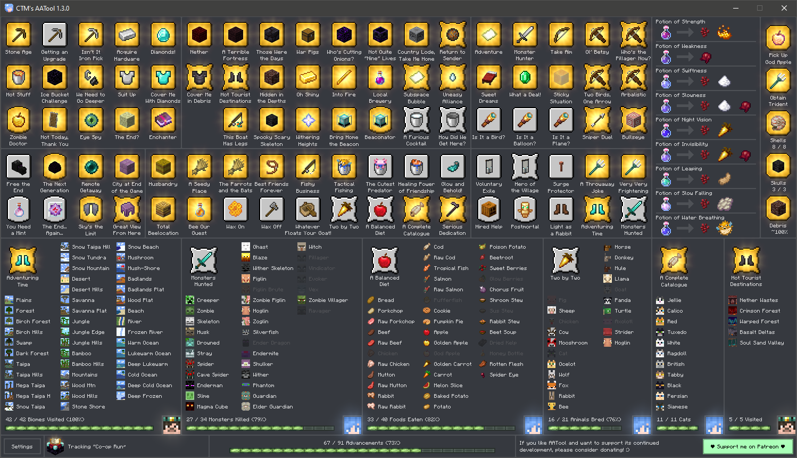

# CTM's AATool

## What is AATool?
AATool is a light-weight, standalone program for tracking Minecraft advancement completion progress! Its clean, yet visually appealing design makes it perfect for professional speedrunners, casual players, and hardcore completionists alike!

It also includes the totally customizable stream overlay that you have likely seen if you've watched [Elysaku's Stream](https://www.twitch.tv/elysaku). Big thanks to him for beta testing this feature! [For a guide on how to set this up yourself, click here!](info/obs.md)

AATool even supports automatic synchronization of multiplayer worlds, and allows you to view the progress of individual players!

_As of August 2021, the AATool project now contains over 13,000 lines of code!_ 🎉

## Want to Contribute?
If you find this tool helpful or enjoy watching someone else who does, consider supporting me on [Patreon](https://www.patreon.com/_ctm) or making a [PayPal](https://www.paypal.com/donate?hosted_button_id=EN29468P8CY24) donation! This is of course completely optional and this program is and always will be completely free for everyone's use! Also, anyone who donates will have their name added to the tool's credits!

Found a bug? Open an [Issue](https://github.com/DarwinBaker/AATool/issues/) and I'll get back to you ASAP! 
Experience a crash? AATool will automatically write a crash log text file in the "logs" folder. Send this to me, and I can get working on a fix!

## How It Works
Due to its unintrusive nature, the tracker only refreshes whenever Minecraft saves. This can be when it autosaves every 5 minutes, but **a save can also be manually triggered by simply pausing and unpausing the game**. Think of *Escape* like a split key for the tracker. (Note that this doesn't work if the game is open to LAN, as the Minecraft server won't pause or save when you press escape) When Minecraft saves it writes all of your advancement progress and stats to JSON files. This program then reads those files and displays their info in a nicely orginized view. The only privilege given to the tracker is `FileAccess.Read`, and `FileShare.ReadWrite | FileShare.Delete` is used while parsing the file so as not to inturrupt Minecraft if it happens to save during a refresh. AATool also comes with an automatic update system, so once you have it up and running you never have to download anything again!

## Speedrun Legality
This tool was designed from the beginning to strictly adhere to the category rules and requirements, and is in accordance with the Speedrun.com Minecraft: Java Edition ruleset as of its public release on 1/25/2021. The guidelines state that you are allowed to read from the advancements and statistics files during a run, which is all this program does. No data is written anywhere aside from the program's own settings files, and absolutely nothing is read from the game's memory. That being said, if the mods have any questions I am more than happy to answer!

## Installation
If you're thinking about taking on the All Advancements category or simply want an epic tracker for your survival world, simply download and run "Setup.exe" or extract the zip file from the [Releases](https://github.com/DarwinBaker/AATool/releases) page. (running Setup.exe will install the necessary files in the same folder you ran it). By default the program will look in your `AppData\Roaming\.minecraft\saves` folder, but if you're using a custom launcher or have moved your save directory, custom save paths are supported.

You will likely run into a Windows SmartScreen pop up stating "Windows protected your PC" when you first run the program. You can safely ignore this and click "Run Anyway" and it shouldn't ask again. 

**DO NOT** install/run any version of this software not downloaded directly from this repository or from the auto-updater. I am not responsible if you run something malicious that looks like this but didn't come from here. This software is provided "as is", without warranty of any kind.

## Compatibility
Due to its use of DirectX for multi-window rendering, this tool is only supported on Microsoft Windows. The official targetted OS is Windows 10, but this should work at least as far back as Windows 7. You _might_ be able to get AATool to work on Linux using the Wine compatibility layer, but I have never tested this. Unfortunately if you're on a Mac you're out of luck. (although I really wouldn't recommend gaming on a Mac in the first place to be honest)

The minimum recommended resolution for using this program is 1280x720. Having a second monitor is by no means necessary, but I can highly recommend it.

## FAQ
**Q:** _Is this a mod or datapack?_

**A:** Nope! This is a standalone tool that reads your save files and tells you what advancements you've completed.
##
**Q:** _I turned on the overlay, why can't I see it in-game?_

**A:** The overlay doesn't show up in-game for the person playing, it's for viewers of your stream/recording. The only way to add an overlay in-game would be through the use of a mod, which this is not.
##
**Q:** _I downloaded the zip but I can't find AATool.exe!_

**A:** You probably downloaded the source code by mistake. You want to download the [Latest Release.](https://github.com/DarwinBaker/AATool/releases/latest)
##
**Q:** _Why isn't AATool reading my save?_

**A:** If you're using a custom save path double check that it has no typos. If you're using the standard `AppData\Roaming\.minecraft\saves` folder, make sure "Use Default" is checked in the program's main settings. AATool will always read the most recently modified world in your saves folder.
##
**Q:** _AATool won't start!_

**A:** If you get an error message stating assets failed to load, try running AAUpdate.exe or re-installing from scratch. If AATool does nothing or the exe disappears when you run it your antivirus is throwing a false positive and you'll need to add AATool.exe and AAUpdate.exe to your list of exceptions.
##
**Q:** _How do I set up the overlay?_

**A:** Check out the [OBS Overlay Setup Guide!](info/obs.md)
##
**Q:** _Will you add this cool new feature I thought of?_

**A:** Ask me! I love when people come to me with ideas to improve this project!
##
**Q:** _When will the next patch be done?_

**A:** It's hard to know, but probably soon! I have a full-time programming job, so finding time to work on AATool isn't always easy. That being said, I love working on it, and even if the GitHub looks static I assure you I'm almost always working on AATool in some capacity!
##

**Q:** _Can I modify this program myself?_

**A:** Yes, by all means! However, it's extremely important that people can be sure the executable they're downloading is 100% safe, and I work very hard to build a reputation of reliability and high polish for AATool. Therefore, all modified source code **MUST** be open and freely available for audit, and all changes **MUST** be documented. Unofficial derivations **MUST** be marked clearly as such, as I cannot vouch for the quality, stability, and security of other people's code. Do this by modifying the window title with the following format: `"CTM's AATool - UNOFFICIALLY MODIFIED BY: <Name>"`. Finally, any modifications to AATool must be released under the same license used by this repository. [(GNU General Public License v3.0)](https://github.com/DarwinBaker/AATool/blob/master/LICENSE.md)
##

#### Find Me On These Platforms:
- [Patreon](https://www.patreon.com/_ctm)
- [YouTube](https://www.youtube.com/channel/UCdJ1FnTvTpna4VGkEyJ9_NA)
- [Twitch](https://www.twitch.tv/ctm_256)
- [Reddit](https://www.reddit.com/user/_CTM_)
- [Speedrun.com](https://www.speedrun.com/user/CTM)
