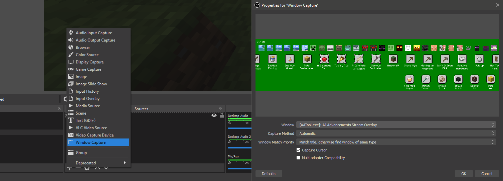
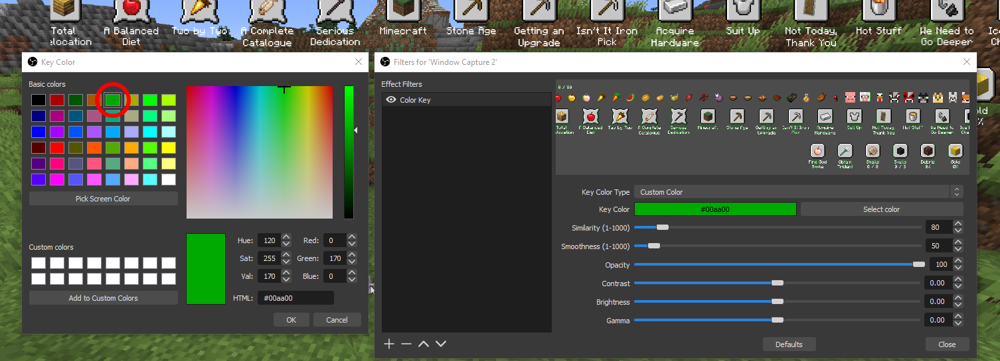

# OBS Overlay Setup Guide
AATool contains an optional, scrolling overview window for the purposes of giving viewers a continuous, visually interesting representation of run progress during a livestream. Given how computationally demanding streaming can be (particularly in AA, as you want to be on 32 render distance most of the time), it was extremely important to me that this be something anyone can use, regardless of how powerful their PC is. As a result, this feature is light-weight and very well optimized. All you have to do to utilize it on your own stream/recordings is check *Enable Overlay Window* in AATool and set up a green screen capture in OBS.
###### If you don't stream using OBS this guide won't be the exact steps you need to take, but any major streaming software should be compatible.

## Add a window capture to your scene


Click on the plus icon in the bottom left of the *Sources* dock and click *Window Capture*.

Then, click the *Window* drop-down and select the entry that matches the program *AATool.exe*, and the window title *All Advancements Stream Overlay*.

## Removing the background


To make the background transparent, start by right-clicking your new window capture, and clicking *Filters*. (almost at the very bottom of the drop-down)

Click the plus icon in the bottom left of the newly opened *Filters* window, and choose *Color Key*. Click on *Key Color Type* and choose *Custom*. 

Click *Select Color*, and make sure the *Key Color* setting in OBS matches the overlay background color chosen in AATool. You can either copy this value from AATool and paste it in the *HTML* box of the color picker, or if you're using the default color in AATool (which I personally recommend) simply choose the green five columns from the left in the top row. ```#00aa00 in HEX, (0,170,0) in RBG``` 

You can leave all the sliders at their default values.

## Odd quirk in OBS

For some reason the preview window usually shows ugly green feathering on the edges of objects and text, however these don't actually show up in the main OBS output as long as you leave your window capture's scale set to default. (I suspect this is likely due to some kind of interpolative scaling filter being applied to the preview). If you accidentally resized your window capture and the green edges are visible in the main window, just right-click your window capture, click *Transform*, and choose *Reset Transform* (you can also press Ctrl+R while the window capture is selected).

#### Find Me On These Platforms:
- [Patreon](https://www.patreon.com/_ctm)
- [Twitch](https://www.twitch.tv/ctm_256)
- [YouTube](https://www.youtube.com/channel/UCdJ1FnTvTpna4VGkEyJ9_NA)
- [Reddit](https://www.reddit.com/user/_CTM_)
- [Speedrun.com](https://www.speedrun.com/user/CTM)

###### Creating this tool took many hours and many energy drinks. If you find it helpful or enjoy watching someone else who does and you want to show your support, consider [donating](https://www.paypal.com/donate?hosted_button_id=EN29468P8CY24) or supporting me on [Patreon](https://www.patreon.com/_ctm)! This program is and always will be completely free for everyone's use. :)
